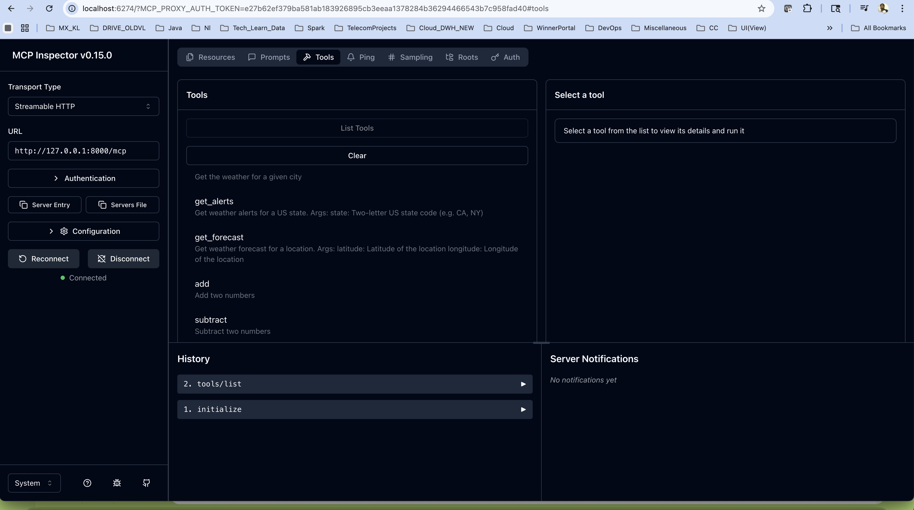

# MCP Inspector  

npx @modelcontextprotocol/inspector


```

a2a-examples) welcome@jaisairams-Laptop fastmcp_fastapi % npx @modelcontextprotocol/inspector
Starting MCP inspector...
⚙️ Proxy server listening on 127.0.0.1:6277
🔑 Session token: e27b62ef379ba581ab183926895cb3eeaa1378284b36294466543b7c958fad40
Use this token to authenticate requests or set DANGEROUSLY_OMIT_AUTH=true to disable auth

🔗 Open inspector with token pre-filled:
   http://localhost:6274/?MCP_PROXY_AUTH_TOKEN=e27b62ef379ba581ab183926895cb3eeaa1378284b36294466543b7c958fad40

🔍 MCP Inspector is up and running at http://127.0.0.1:6274 🚀
New StreamableHttp connection request
Query parameters: {"url":"http://localhost:10000","transportType":"streamable-http"}
Created StreamableHttp server transport
Created StreamableHttp client transport
Client <-> Proxy  sessionId: 84c498e2-a3d8-49a9-a47e-707e8548b5cf
Connection refused. Is the MCP server running?
New StreamableHttp connection request
Query parameters: {"url":"http://localhost:10000","transportType":"streamable-http"}
Created StreamableHttp server transport
Created StreamableHttp client transport
Client <-> Proxy  sessionId: 32d8fd15-9454-4ee1-9e1d-3e6f65c159da
Connection refused. Is the MCP server running?
New StreamableHttp connection request
Query parameters: {"url":"http://localhost:8000","transportType":"streamable-http"}
Created StreamableHttp server transport
Created StreamableHttp client transport
Client <-> Proxy  sessionId: 4b9da81f-c8cc-496b-9724-5fead0a5452f
Connection refused. Is the MCP server running?
New StreamableHttp connection request
Query parameters: {"url":"http://127.0.0.1:8000","transportType":"streamable-http"}
Created StreamableHttp server transport
Created StreamableHttp client transport
Client <-> Proxy  sessionId: 37f47e62-8c79-48b4-aeec-d1afa1da9842
Connection refused. Is the MCP server running?
New StreamableHttp connection request
Query parameters: {"url":"http://127.0.0.1:8000","transportType":"streamable-http"}
Created StreamableHttp server transport
Created StreamableHttp client transport
Client <-> Proxy  sessionId: c3972f48-e63a-4914-927b-2ae871bf3b8e
Connection refused. Is the MCP server running?
New StreamableHttp connection request
Query parameters: {"url":"http://127.0.0.1:8000","transportType":"streamable-http"}
Created StreamableHttp server transport
Created StreamableHttp client transport
Client <-> Proxy  sessionId: 28161aae-f89a-47ff-b973-6e5dd3dd0ae3
Connection refused. Is the MCP server running?
New StreamableHttp connection request
Query parameters: {"url":"http://127.0.0.1:8000","transportType":"streamable-http"}
Created StreamableHttp server transport
Created StreamableHttp client transport
Client <-> Proxy  sessionId: eab2e278-f214-4323-a5da-2f326629d1b4
Connection refused. Is the MCP server running?
New StreamableHttp connection request
Query parameters: {"url":"http://127.0.0.1:8000/mcp","transportType":"streamable-http"}
Created StreamableHttp server transport
Created StreamableHttp client transport
Client <-> Proxy  sessionId: 56c9eedb-60fd-4391-8538-09382496efd1
Proxy  <-> Server sessionId: 6ec802d5f66945228f4bf9b55529861f
Received POST message for sessionId 56c9eedb-60fd-4391-8538-09382496efd1
Received GET message for sessionId 56c9eedb-60fd-4391-8538-09382496efd1
Received POST message for sessionId 56c9eedb-60fd-4391-8538-09382496efd1

```

# MCP Inspect URL access

http://localhost:6274/?MCP_PROXY_AUTH_TOKEN=e27b62ef379ba581ab183926895cb3eeaa1378284b36294466543b7c958fad40#tools





# MCP inspect

1. https://medium.com/@laurentkubaski/how-to-use-mcp-inspector-2748cd33faeb
